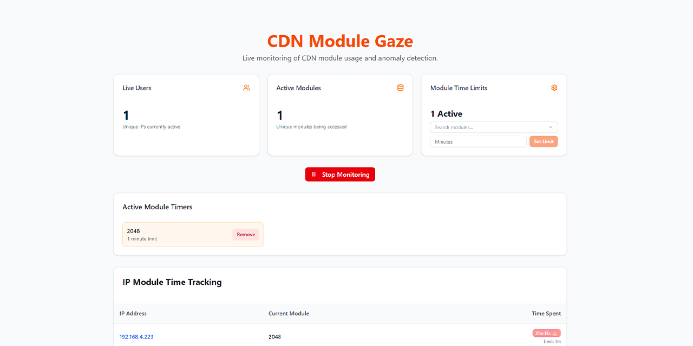

# Module Gaze

This is an application that allows admins at the clc or centers to monitor the modules people are viewing in real-time.

It's running on the port `3002`.

## Overview

CDN Module Gaze monitors your existing `oc4d.service` logs in real-time to track user activity across different modules. It provides live statistics, time tracking per IP address, and configurable time limits with alerts when users exceed specified durations.

## Features

- 🔴 **Real-time Log Monitoring**: Streams live logs from `oc4d.service` using Server-Sent Events
- 📊 **Live Statistics**: Shows active users, modules, and session counts
- ⏱️ **Time Tracking**: Tracks how long each IP spends on each module (live seconds counter)
- 🚨 **Time Limits & Alerts**: Set time limits for specific modules with visual and alert notifications
- 🎯 **Smart Module Matching**: Links log module names to database module names using URL patterns
- 📱 **Responsive Design**: Works on desktop and mobile devices
- 🌙 **Modern UI**: Clean, professional interface with real-time updates

## How It Works

### 1. Log Monitoring Architecture

```ml
┌─────────────────┐    ┌──────────────────┐    ┌─────────────────┐
│ oc4d.service    │───▶│ journalctl -f    │───▶│ Next.js API     │
│                 │    │ (log streaming)  │    │ /api/logs/stream│
└─────────────────┘    └──────────────────┘    └─────────────────┘
                                                    │
                                                    ▼
┌─────────────────┐    ┌──────────────────┐    ┌─────────────────┐
│ Web Browser     │◀───│ Server-Sent      │◀───│ Log Parser      │
│ (React UI)      │    │ Events (SSE)     │    │ (IP + Module)   │
└─────────────────┘    └──────────────────┘    └─────────────────┘
```

### 2. Log Parsing Process

The system monitors logs with this format:

```bash
Jul 02 03:13:12 cdn oc4d[2369]: info: ::ffff:192.168.4.238 - [2024-07-02T03:13:12.202Z] "GET /modules/cdn_acid_bases_and_salts/content/index.html HTTP/1.1" 200
```

**Extraction Process:**

1. **IP Address**: Extracts IPv4 from `::ffff:192.168.4.238` → `192.168.4.238`
2. **Module Name**: Extracts from URL `/modules/cdn_acid_bases_and_salts/...` → `cdn_acid_bases_and_salts`
3. **Session Tracking**: Links IP + Module to create/update user sessions

### 3. Module Matching System

The system uses a smart matching algorithm to link log module names with database module names:

```bash
Database Module:
├── name: "Acid, Bases, And Salts"
├── indexHtmlUrl: "/modules/cdn_acid_bases_and_salts/content/index.html"
└── URL ID: "cdn_acid_bases_and_salts" (extracted from indexHtmlUrl)

Log Entry:
├── URL: "/modules/cdn_acid_bases_and_salts/content/node/lesson1.html"
└── Module ID: "cdn_acid_bases_and_salts" (extracted from URL)

Match: ✅ URL ID === Module ID
```

### 4. Time Tracking & Limits

**Session Management:**

- One active session per IP address
- Sessions timeout after 100 minutes of inactivity
- Time tracking starts when module access is detected
- Live counter updates every second

**Timer System:**

- Set time limits for specific modules (by database name)
- Smart matching links timers to log sessions
- Visual indicators when limits are exceeded
- Configurable alerts and notifications

## Usage Guide

### 1. Starting Monitoring

1. Open the application in your browser
2. Click **"Start Monitoring"** button
3. The system begins streaming logs in real-time
4. Active sessions appear in the tracking table

### 2. Setting Time Limits

1. **Search for Module**: Use the dropdown to find a module
2. **Set Duration**: Enter time limit in minutes
3. **Activate Timer**: Click "Set Limit" to activate
4. **Monitor Status**: Active timers show in the dashboard

### 3. Monitoring Sessions

**Live Tracking Table shows:**

- IP addresses of active users
- Current module being accessed
- Live time counter (updates every second)
- Visual alerts when time limits exceeded

### 4. Understanding Alerts

When a user exceeds a time limit:

- Time badge turns red and pulses
- Alert notification appears at top
- Console logs violation details
- Session continues tracking (doesn't stop)

## Installation

To install CDN Module Gaze follow the commands below;

1. Connect the server to the internet and ssh into the server

    ```bash
    ssh pi@cdn.local
    ```

2. Clone the repo

    ```bash
    git clone https://github.com/ComDevNet/cdn-module-gaze.git 
    ```

    ```bash
    cd cdn-module-gaze
    ```

3. Run the Install script

    ```bash
    chmod +x install.sh
    ```

    ```bash
    ./install.sh
    ```

4. Now all you need to do is visit `http://oc4d.cdn:3002` and click on the `start monitoring` button

---

**Built with:** Next.js 14, React 18, TypeScript, Prisma, PostgreSQL, Tailwind CSS, shadcn/ui
